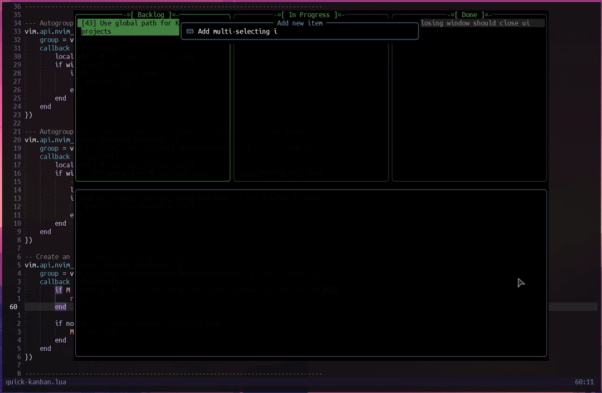
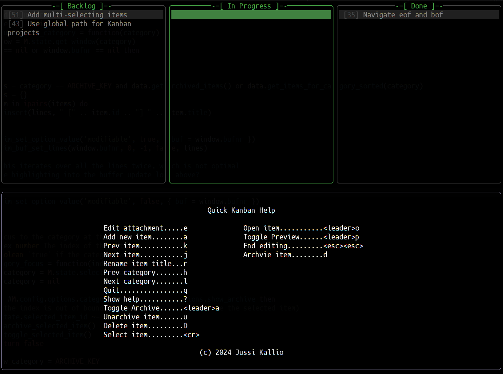
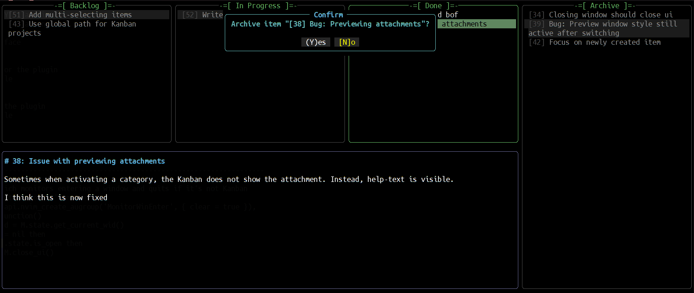

<div align="center">

# Quick Kanban

A plugin for quickly managing your project tasks in a kanban board.

All the data is stored as files inside a project folder as text/markdown files. Metadata is stored as JSON.

This plugin requires neovim 0.6 or higher. Since this plugin is mainly written in lua, it will not work with Vim.

[](http://www.lua.org)
[](https://neovim.io)

Author: Jussi Kallio <jkallio+quick-kanban@gmail.com>

</div>

## Introduction

This plugin was built to help manage project tasks in a kanban board quickly without having to leave the editor. It is *not* meant to replace a full-featured project management tool, and is best suited for small projects for personal use or small teams.

## Features

- [x] Simple and intuitive interface.
- [x] File based task management.
- [x] Customizable Kanban categories.
- [x] Customizable keybindings.
- [x] Quickly add, move, and delete tasks.
- [x] Item archiving for completed tasks.
- [x] Preview markdown files in a floating window.
- [x] Edit markdown files directly in Kanban UI.


## Installation

Using [vim-plug](https://github.com/junegunn/vim-plug)
```vim
Plug 'nvim-lua/plenary.nvim' " Required dependency
Plug 'jkallio/quick-kanban.nvim'
```

Using [packer](https://github.com/wbthomason/packer.nvim)
```lua
use {
  'jkallio/quick-kanban.nvim',
  requires = { {'nvim-lua/plenary.nvim'} }
}
```

Using [lazy](https://github.com/folke/lazy.nvim)
```lua
return {
    {
    'jkallio/quick-kanban.nvim',
      dependencies = { 'nvim-lua/plenary.nvim' }
    }
}
```

## Setup

The plugin does not require any special setup to work. However if you want to
customize the default behavior or style, you can pass a table of options using
the `setup` function.

```lua
require'quick-kanban'.setup({
  -- Full path to directory where the kanban board data will be stored.
  -- Leave nil to create the directory in the current working directory.
  path = nil,

  -- Log level for the plugin. Set to nil to disable logging.
  -- Possible values: "debug" | "info" | "warn" | "error" | nil
  log_level = "warn",

  -- Subdirectories for different files in the kanban board.
  subdirectories = {
    items = ".items",             -- Directory for the items metadata
    archive = ".archive",         -- Directory for the archived items
    attachments = ".attachments", -- Directory for the attachments
  },

  -- A list of categories for the default kanban board.
  default_categories = {
    'Backlog',
    'In Progress',
    'Done',
  },

  -- The key mappings for the kanban UI.
  mappings = {
    show_help = '?',
    next_category = 'l',
    prev_category = 'h',
    next_item = 'j',
    prev_item = 'k',
    add_item = 'a',
    edit_item = 'e',
    end_editing = '<esc><esc>',
    archive_item = 'd',
    unarchive_item = 'u',
    delete = 'D',
    open_item = '<leader>o',
    rename = 'r',
    select_item = '<cr>',
    toggle_archive = '<leader>a',
    toggle_preview = '<leader>p',
    quit = { 'q', '<esc>' }, -- You can assign multiple keys
  },

  -- List of disabled key mappings (to ensure the usability)
  disabled_keys = { 'a', 'c', 'd', 'i', 'm', 'o', 'p', 'r', 'x', 'gg', 'G', '<esc>', '<tab>', '<cr>', '<bs>', '<del>' },

  -- The window configuration for the kanban board
  window = {
    width = 40,         -- Width of each kanban category window
    height = 30,        -- Height of the kanban UI
    title_decoration = { "-=[ ", " ]=-" },  -- Title decoration (prefix and suffix)
    blend = 5,          -- The transparency of the kanban board window. (0-100)
    vertical_gap = 1,   -- Gap between the windows (vertical)
    horizontal_gap = 2, -- Gap between the windows (horizontal)
    hide_cursor = true, -- Hide the cursor when the kanban is opened.
    accent_color = "#44AA44",     -- Accent color for the kanban board window.
    hilight_color = "#FFFF44",    -- Highlight color for the kanban board window.
    active_text_bg = "#448844",   -- Background color of the active item
    active_text_fg = "#000000",   -- Text color of the active item
    selected_text_bg = "#888844", -- Background color of the selected item.
    selected_text_fg = "#000000", -- Text color of the selected item.
  },

  number = true,        -- Show line numbers in Edit mode
  wrap = true,          -- Wrap lines in Kanban category windows
  show_preview = true,  -- Show the preview window
  show_archive = false, -- Show the archive window
})
```

## Usage

To open the Kanban board, run the `:QuickKanban` command. This will open the Kanban UI in a floating window. The UI is divided into two windows: the Kanban board on the top, and the preview window on the bottom. If Archive view is on, the window will appear on the right side of the Kanban board.

You can move an item from one category to another by selecting the item first and then pressing `l` to move it to the next category, or `h` to move it to the previous category. 

To change the order of the items in a category, you can select an item and the use `j` and `k` to move the cursor up and down.

To add a new item, press `a`. This will open a prompt to insert the title of the new item. Press <cr> to confirm the title, and the item will be added to the current category.

To archive an item, select the item and press `d`. This will move the item to the archive category. To unarchive an item, press `u` in the archive view.

To delete an item permanently, select the item and press `D`. This will delete the item from the project folder. Be careful, as this action cannot be undone.

To rename an item, select the item and press `r`. This will open a prompt to insert the new title of the item. Press <cr> to confirm the new title.

To open the markdown file of an item in a new buffer, select the item and press `o`.

To toggle the archive view, press `<leader>a`. This will show or hide the archive window on the right side of the Kanban board.

To toggle the preview window, press `<leader>p`. This will show or hide the preview window on the bottom of the Kanban board.

To quit the Kanban UI, press `q`.

To show the help message, press `?`.

## Edit Mode

Edit mode is a special mode that allows you to edit the markdown file of an item directly in the Kanban UI. To enter edit mode, press `e` while the cursor is on the item you want to edit. This will switch the window focus into the preview window, and allow you to edit the markdown file.

To exit edit mode, press <esc><esc>. This will save the changes to the file and return the focus back to the Kanban UI.

You can also edit the markdown file by pressing `o` in the Kanban UI. This will open the markdown file in a new buffer, and you can edit it there like any other file in Neovim.

## Folder Structure

The Kanban board is stored as a collection of text files in a project folder.

Each task is stored in the `.items` folder as a JSON metadata file. The meta file contains information like the title, category, order, and attachment.

The markdown content of the item is stored in a separate file in the `.attachments` folder.

Archived items are stored in the `.archive` folder. The archived items are stored as JSON metadata files, similar to the active items. The markdown content of the archived items is still stored in the `.attachments` folder.

The folder structure is as follows:

```
    project_folder/
    ├── .items/
    │   ├── item1
    │   ├── item2
    │   └── ...
    ├── .archive/
    │   ├── item3
    │   ├── item4
    │   └── ...
    ├── .attachments/
    │   ├── item1.md
    │   ├── item2.md
    │   └── ...
    └── metadata.json
```

## Screenshots




